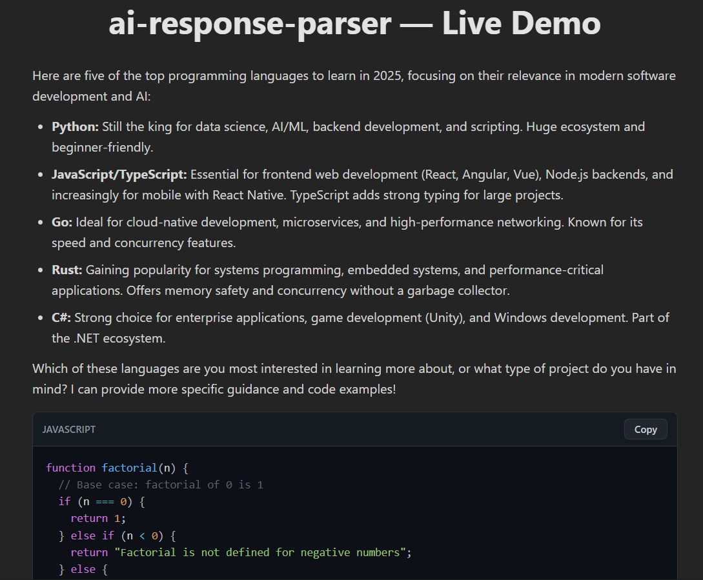

# AI Response Parser - React Component for AI/LLM Responses

**A lightweight, zero-dependency React component that beautifully renders AI/LLM responses with full Markdown support and syntax-highlighted code blocks. Perfect for ChatGPT, Gemini, and AI chatbot UIs.**

🚀 Super lightweight • 📦 Zero dependencies • 🎨 9 stunning themes • ⚡ Streaming ready • 🎯 TypeScript supported

## Why Choose AI Response Parser?

Parse and format AI responses with beautiful Markdown rendering, code syntax highlighting, and responsive tables.

## Installation

```bash
npm install ai-response-parser
# or
yarn add ai-response-parser
# or
pnpm add ai-response-parser
```

## Features

- Full Markdown support (headings, bold, lists, tables, quotes, links)
- Syntax highlighting — no Prism/Highlight.js
- **9 gorgeous built-in themes**
- Streaming friendly (perfect for AI chat apps)
- Copy-to-clipboard functionality for code blocks

---

## Basic Usage

```tsx
import { AIResponseParser } from 'ai-response-parser';

const aiMessage = `
Here's a factorial function in JavaScript:

\`\`\`javascript
function factorial(n) {
  if (n <= 1) return 1;
  return n * factorial(n - 1);
}
console.log(factorial(5)); // 120
\`\`\`

Want BigInt support or an iterative version too?
`;

export default function ChatBubble() {
  return (
    <div className="max-w-3xl mx-auto p-8>
      <AIResponseParser
        content={aiMessage}
        themeName="onedark"
        textColor="#e2e8f0"
      />
    </div>
  );
}
```



---

## Props

| Prop        | Type     | Default     | Description                                     |
| ----------- | -------- | ----------- | ----------------------------------------------- |
| `content`   | `string` | —           | Required — Your AI response (Markdown + code)   |
| `themeName` | `string` | `"onedark"` | Choose from 9 themes                            |
| `textColor` | `string` | —           | Text color outside code blocks (hex, rgb, etc.) |
| `className` | `string` | —           | Add Tailwind or custom classes                  |

---

## 9 Built-in Themes

| Theme           | Preview                         |
| --------------- | ------------------------------- |
| `onedark`       | Default dark — clean & modern   |
| `dracula`       | Purple power — bold & beautiful |
| `nord`          | Arctic, calm & minimalist       |
| `vscode`        | Classic VS Code style           |
| `monokai`       | Retro Sublime vibes             |
| `github`        | Clean light theme               |
| `solarizedDark` | Perfect contrast & eye comfort  |
| `tomorrowNight` | Soft glow — easy on the eyes    |
| `light`         | Pure bright mode                |

---

## More Examples

```tsx
<AIResponseParser
  content={response}
  themeName="nord"
  textColor="#d8dee9"
  className="prose prose-invert max-w-none"
/>
```

Easy to integrate with **React**, **Next.js**, **Vite**, **Remix**, and more!

---

## License

**MIT** © [Manoj Belbase](https://github.com/manojbelbase)

Free for everyone — personal & commercial use!

---

**Love it? Star us on GitHub!**  
[https://github.com/ManojBelbase/ai-response-parser](https://github.com/ManojBelbase/ai-response-parser)

Issues · Feature requests · PRs very welcome

Made with love for the **React + AI** community by **Manoj Belbase**
