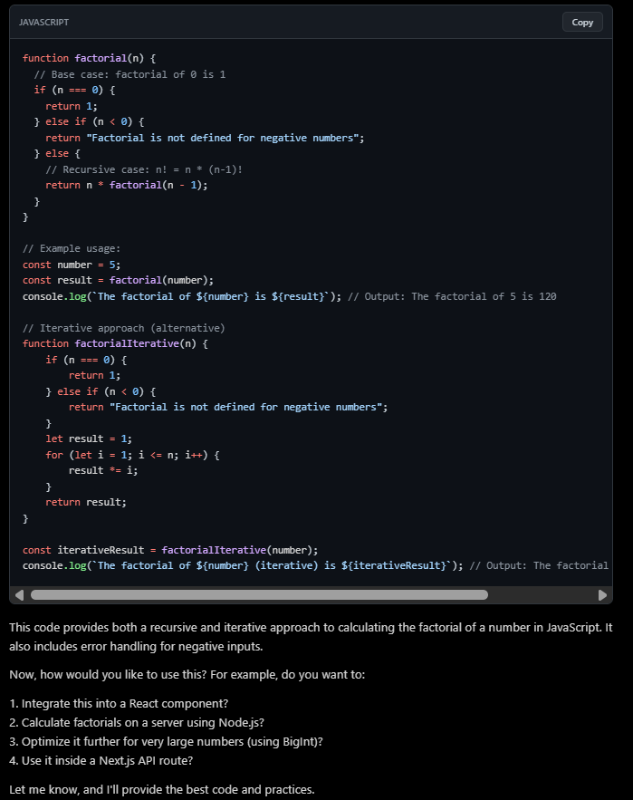

# 🧠 ai-response-parser

A React component to render AI responses, including Markdown, syntax-highlighted code blocks, and dark mode support. Ideal as an AI code converter, AI coder tool, code formatter, or AI code parser in your React projects. 🚀

Works instantly with React, Next.js, Vite, Remix, etc.

## ✨ Features

- Full Markdown (headers, **bold**, *italic*, lists, links, tables, quotes)
- Automatic syntax highlighting for 100+ languages
- Dark & Light mode
- 5 stunning built-in themes: `vscode · monokai · dracula · github · oneDark`
- Fully customizable colors
- Zero extra dependencies

## 📦 Installation

```bash
npm install ai-response-parser
# or
yarn add ai-response-parser
# or
pnpm add ai-response-parser
```

## 🚀 Basic Usage

```tsx
import { AIResponseParser } from 'ai-response-parser';

    const response = "```javascript\nfunction factorial(n) {\n  // Base case: factorial of 0 is 1\n  if (n === 0) {\n    return 1;\n  } else if (n < 0) {\n    return \"Factorial is not defined for negative numbers\";\n  } else {\n    // Recursive case: n! = n * (n-1)!\n    return n * factorial(n - 1);\n  }\n}\n\n// Example usage:\nconst number = 5;\nconst result = factorial(number);\nconsole.log(`The factorial of ${number} is ${result}`); // Output: The factorial of 5 is 120\n\n// Iterative approach (alternative)\nfunction factorialIterative(n) {\n    if (n === 0) {\n        return 1;\n    } else if (n < 0) {\n        return \"Factorial is not defined for negative numbers\";\n    }\n    let result = 1;\n    for (let i = 1; i <= n; i++) {\n        result *= i;\n    }\n    return result;\n}\n\nconst iterativeResult = factorialIterative(number);\nconsole.log(`The factorial of ${number} (iterative) is ${iterativeResult}`); // Output: The factorial of 5 (iterative) is 120\n\n```\n\nThis code provides both a recursive and iterative approach to calculating the factorial of a number in JavaScript.  It also includes error handling for negative inputs.\n\nNow, how would you like to use this?  For example, do you want to:\n\n1.  Integrate this into a React component?\n2.  Calculate factorials on a server using Node.js?\n3.  Optimize it further for very large numbers (using BigInt)?\n4.  Use it inside a Next.js API route?\n\nLet me know, and I'll provide the best code and practices.\n"


export default function App() {
  return (
    <div className="min-h-screen bg-black p-10 text-white">
      <h1 className="text-3xl mb-8">AI Response Parser Demo</h1>
      <AIResponseParser content={response} darkMode={true} themeName="oneDark" />
    </div>
  );
}
```
Response Format:


## 🛠 Props

| Prop        | Type                                              | Default    | Description                          |
|-------------|---------------------------------------------------|------------|--------------------------------------|
| `content`   | `string`                                          | —          | Required – Your AI response text     |
| `darkMode`  | `boolean`                                         | `true`     | Dark mode on/off                     |
| `themeName` | `"vscode" \| "monokai" \| "dracula" \| "github" \| "oneDark"` | `"oneDark"` | Built-in theme                |
| `colors`    | `Partial<Theme>`                                  | `{}`       | Override any color                   |
| `className` | `string`                                          | `""`       | Extra CSS classes                    |

## 🎨 Built-in Themes

- **vscode** 💻**
- **monokai** 🌙
- **dracula** 🧛‍♂️
- **github** 🐱 (great for light mode)
- **oneDark** 🌑 (default – most popular)

## 💡 More Examples

### Multiple Languages

```tsx
const example = `
**JavaScript**
\`\`\`javascript
const fibonacci = n => n <= 1 ? n : fibonacci(n-1) + fibonacci(n-2);
\`\`\`

**Python**
\`\`\`python
def fibonacci(n):
    return n if n <= 1 else fibonacci(n-1) + fibonacci(n-2)
\`\`\`

**Rust**
\`\`\`rust
fn fibonacci(n: u32) -> u32 {
    match n {
        0 | 1 => n,
        _ => fibonacci(n-1) + fibonacci(n-2),
    }
}
\`\`\`
`;

<AIResponseParser content={example} themeName="dracula" />
```

### Light Mode Example

```tsx
<AIResponseParser
  content={response}
  darkMode={false}
  themeName="github"
/>
```

## 🔥 Tips

- Works perfectly with streaming responses (just update the `content` prop)
- Combine with Tailwind CSS for even prettier layouts
- Code blocks are copy-to-clipboard ready (optional button coming soon)

## 📝 License

MIT © [Manoj Belbase](https://github.com/manojbelbase) – Free for everyone!

---

⭐ If this saved you time, please give it a star on GitHub!  
 Issues · Feature requests · PRs are very welcome ❤️

Made with love for the AI + React community by **Manoj Belbase**
